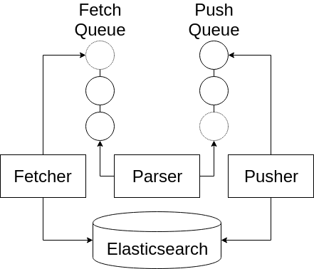

# K8sCop

_K8sCop fetches ElasticSearch k8s logs, parses the logs to detect and label interesting events, and pushes alerts back to ElasticSearch._

## Introduction

K8sCop is designed to make the analysis of Kubernetes audit logs easier.
The system classifies logs into labelled events using regular expressions and provides more clarity about Kubernetes events. 
K8sCop can perform a static analysis on a specific date range or streaming analysis in (almost) real time. It makes use of the Python Elasticsearch client and is multi-threaded for extra speed.

## Usage

```
$ ./app.py -h
usage: app.py [-h] --elastic ES --pages PAGES --alerts ALERTS --start START
              --analysis {static,streaming} [--end END]
              [--fetch-delay {3,5,8,10,12}]
```

- `-E`: the `ip:port` of the ElasticSearch instance
- `-I`: the index of the logs page
- `-i`: the index of the alerts page
- `-s`: the desired start date and time of the analysis
- `-A`: set the analysis to static or streaming

If the analysis is static, the end date and time of the analysis must be set:

- `-e`: the end date and time of the **static** analysis [optional]

If the end date and time is not given, the end date and time is automatically set to _utcnow_. 

If the analysis is streaming, a delay between log fetches must be set, because of potential Elasticsearch latency:

- `-d`: the delay between log fetches in seconds for **streaming** analysis [optional]

## Flow Diagram



The Fetcher fetches data from ElasticSearch every `d` seconds and puts each entry into the Fetch Queue. 
The Parser gets data from the Fetch Queue, parses each entry and does regex pattern matching. 
If a pattern is matched, an alert specifc to the pattern is put in the Push Queue.
The Pusher gets alerts from the Push Queue and pushes them back to ElasticSearch every second.

In this implementation of K8sCop, there are multiple push queues and associated pushers running on separate threads for the different types of alerts. 


## Example How-to-Run

### Static Analysis

```
$ ./app.py -E 172.16.137.133:9200 -I logstash -i alerts -s 2019-2-1-0-0-0 
           -e 2019-3-2-0-0-0 --analysis static
```

### Streaming Analysis

```
$ ./app.py -E 172.16.137.133:9200 -I logstash -i alerts -s 2019-2-1-0-0-0 
           --analysis streaming   
```

### Important

Time must be given in UTC format. 

## Sample from Kibana


## Future Work

- Create an interface for adding new rules
- Correlate multiple events to detect more complex attacks
- Integrate triggers
- Make K8sCop interact with Kubernetes itself